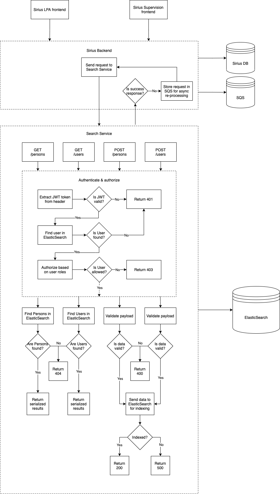

# opg-search-service
Development repository: Managed by opg-org-infra &amp; Terraform

## Local Development

### Required Tools

- Go 1.16
- Docker with docker-compose

### Optional Tools

- [GoTestSum](https://github.com/gotestyourself/gotestsum) - `go test` runner with optimized output

### Development environment

Use docker-compose commands to build/start/stop the service locally e.g. `docker-compose up --build` will rebuild and start the service.

By default the local URL is http://localhost:8000/services/search-service, where `/services/search-service` is configured by the `PATH_PREFIX` ENV variable.

### Tests

Run `make test` to execute the test suites and output code coverage for each package.

#### End-to-end tests

End-to-end tests are executed as part of the `make test` command.

Generally they sit in `main_test.go`. The test suite will start up the search service in a go-routine to run tests against it, and therefore all ENV variables required for configuring the service have to be set prior to running the test suite. This is all automated with the `make test` command.

## Swagger docs

Run `make docs` or `make swagger-up` to view swagger docs at http://localhost:8383/

#### Updating swagger docs

Run `make swagger-generate` to update the swagger.yml file

The search service uses [Go Swagger](https://goswagger.io/) to generate the ./swagger.yml file from annotations in the code itself. See ./main.go for examples. [Go Swagger](https://goswagger.io/) is based on [Swagger 2.0](https://swagger.io/docs/specification/2-0/basic-structure/). Be careful not to confuse it with OpenAPI v3.

Another gotcha... Make sure annotations are written with 2 space tabs in order for the parser to work correctly!

## Diagram

## Environment Variables

| Variable                   | Default                           |  Description   |
| -------------------------- | --------------------------------- | -------------- |
| AWS_ELASTICSEARCH_ENDPOINT |                                   | Used for overwriting the ElasticSearch endpoint locally e.g. http://localstack:4571 |
| AWS_REGION                 | eu-west-1                         | Set the AWS region for all operations with the SDK                                  |
| AWS_ACCESS_KEY_ID          |                                   | Used for authenticating with localstack e.g. set to "localstack"                    |
| AWS_SECRET_ACCESS_KEY      |                                   | Used for authenticating with localstack e.g. set to "localstack"                    |
| PATH_PREFIX                |                                   | Path prefix where all requested will be routed                                      |
